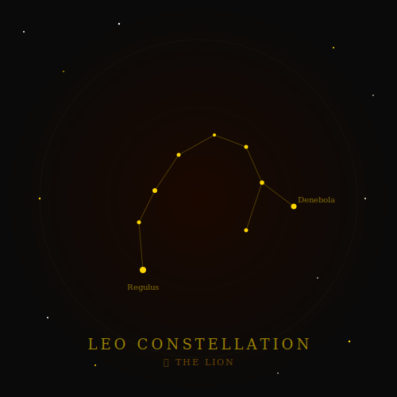

<!-- ═══════════════════════════════════════════════════════════════ -->
<!-- ♌ LEO UNIVERSE PROFILE — by Duong Thai Tan                    -->
<!-- ═══════════════════════════════════════════════════════════════ -->

<!-- ✦ ANIMATED LEO HEADER (SVG with CSS animations) ✦ -->
<div align="center">
  
</div>

<!-- ✦ ANIMATED TYPING ✦ -->
<div align="center">
  <a href="https://git.io/typing-svg">
    
  </a>
</div>

<br>

<!-- ✦ 3D INTERACTIVE LINKS ✦ -->
<div align="center">
  <a href="https://duongthaitan.github.io/duongthaitan/leo-3d/index.html">
    
  </a>
  &nbsp;
  <a href="https://duongthaitan.github.io/duongthaitan/leo-3d/lion-particle.html">
    
  </a>
</div>

<br>

<!-- ✦ FIRE DIVIDER ✦ -->


<br>

<!-- ══════════════════════════════════════════════════════════════ -->
<!-- 👑 ABOUT THE LION                                              -->
<!-- ══════════════════════════════════════════════════════════════ -->
<div align="center">
  <h2>
    &nbsp;
    👑 About The Lion
    &nbsp;
  </h2>
</div>

<table>
  <tr>
    <td width="55%">

```js
// ♌ leo_profile.js — The Lion's Code

const leoKing = {
  name: "Duong Thai Tan",
  zodiac: "♌ Leo — The Lion",
  element: "🔥 Fire",
  rulingPlanet: "☀️ The Sun",
  aka: "Tandev.foto",
  location: "Vietnam 🇻🇳",
  role: "Frontend Developer & UI/UX Designer",
  
  leoTraits: [
    "👑 Natural Leader",
    "🔥 Passionate & Creative",
    "🦁 Brave & Confident",
    "💛 Warm & Generous"
  ],
  
  currentlyLearning: [
    "Advanced Frontend Architecture",
    "Three.js & WebGL",
    "UI/UX Design Systems"
  ],
  
  passions: [
    "Pixel-Perfect Interfaces",
    "Photography 📸",
    "Video Editing 🎬"
  ],
  
  motto: "A lion doesn't lose sleep over the opinion of sheep. 🦁"
};
```

</td>
    <td width="45%" align="center">
      
      <br>
      
      <br>
      
    </td>
  </tr>
</table>

<br>


<br>

<!-- ══════════════════════════════════════════════════════════════ -->
<!-- 🔗 CONNECT WITH THE LION                                      -->
<!-- ══════════════════════════════════════════════════════════════ -->
<div align="center">
  <h2>
    &nbsp;
    🔗 Connect With The Lion
    &nbsp;
  </h2>
</div>

<div align="center">
  <table>
    <tr>
      <td align="center" width="110">
        <a href="https://github.com/duongthaitan" title="GitHub"></a>
        <br><sub><b>GitHub</b></sub>
      </td>
      <td align="center" width="110">
        <a href="https://www.linkedin.com/in/duongthaitan/" title="LinkedIn"></a>
        <br><sub><b>LinkedIn</b></sub>
      </td>
      <td align="center" width="110">
        <a href="mailto:matan13@gmail.com" title="Email"></a>
        <br><sub><b>Gmail</b></sub>
      </td>
      <td align="center" width="110">
        <a href="https://www.facebook.com/duongthaitan/" title="Facebook"></a>
        <br><sub><b>Facebook</b></sub>
      </td>
      <td align="center" width="110">
        <a href="https://www.instagram.com/thaitan.duong_" title="Instagram"></a>
        <br><sub><b>Instagram</b></sub>
      </td>
      <td align="center" width="110">
        <a href="https://zalo.me/0336608983" title="Zalo"></a>
        <br><sub><b>Zalo</b></sub>
      </td>
      <td align="center" width="110">
        <a href="https://www.tiktok.com/@tandev.foto" title="TikTok"></a>
        <br><sub><b>TikTok</b></sub>
      </td>
    </tr>
  </table>
</div>

<br>


<br>

<!-- ══════════════════════════════════════════════════════════════ -->
<!-- ⚡ THE LION'S ARSENAL                                         -->
<!-- ══════════════════════════════════════════════════════════════ -->
<div align="center">
  <h2>
    &nbsp;
    ⚡ The Lion's Arsenal
    &nbsp;
  </h2>
</div>

<details open>
  <summary><h3>🎨 Frontend Fire</h3></summary>
  <div align="center">
    <a href="https://developer.mozilla.org/en-US/docs/Web/HTML" title="HTML5"></a>&nbsp;&nbsp;
    <a href="https://developer.mozilla.org/en-US/docs/Web/CSS" title="CSS3"></a>&nbsp;&nbsp;
    <a href="https://developer.mozilla.org/en-US/docs/Web/JavaScript" title="JavaScript"></a>&nbsp;&nbsp;
    <a href="https://vuejs.org/" title="Vue.js"></a>&nbsp;&nbsp;
    <a href="https://getbootstrap.com/" title="Bootstrap"></a>&nbsp;&nbsp;
    <a href="https://threejs.org/" title="Three.js"></a>&nbsp;&nbsp;
  </div>
</details>

<details open>
  <summary><h3>⚙️ Backend Forge</h3></summary>
  <div align="center">
    <a href="https://www.php.net/" title="PHP"></a>&nbsp;&nbsp;
    <a href="https://www.java.com/" title="Java"></a>&nbsp;&nbsp;
    <a href="https://docs.microsoft.com/en-us/dotnet/csharp/" title="C#"></a>&nbsp;&nbsp;
    <a href="https://isocpp.org/" title="C++"></a>&nbsp;&nbsp;
  </div>
</details>

<details open>
  <summary><h3>🗄️ Database Crown</h3></summary>
  <div align="center">
    <a href="https://www.mysql.com/" title="MySQL"></a>&nbsp;&nbsp;
    <a href="https://www.microsoft.com/en-us/sql-server" title="SQL Server"></a>&nbsp;&nbsp;
  </div>
</details>

<details open>
  <summary><h3>🛸 Frameworks & Kingdoms</h3></summary>
  <div align="center">
    <a href="https://laravel.com/" title="Laravel"></a>&nbsp;&nbsp;
    <a href="https://dotnet.microsoft.com/" title=".NET"></a>&nbsp;&nbsp;
    <a href="https://wordpress.org/" title="WordPress"></a>&nbsp;&nbsp;
  </div>
</details>

<details open>
  <summary><h3>🔧 Royal Tools</h3></summary>
  <div align="center">
    <a href="https://code.visualstudio.com/" title="VS Code"></a>&nbsp;&nbsp;
    <a href="https://visualstudio.microsoft.com/" title="Visual Studio"></a>&nbsp;&nbsp;
    <a href="https://unity.com/" title="Unity"></a>&nbsp;&nbsp;
    <a href="https://developer.android.com/studio" title="Android Studio"></a>&nbsp;&nbsp;
    <a href="https://www.figma.com/" title="Figma"></a>&nbsp;&nbsp;
    <a href="https://www.adobe.com/products/photoshop.html" title="Photoshop"></a>&nbsp;&nbsp;
    <a href="https://www.adobe.com/products/photoshop-lightroom.html" title="Lightroom"></a>&nbsp;&nbsp;
    <a href="https://github.com/" title="GitHub"></a>&nbsp;&nbsp;
    <a href="https://www.selenium.dev/" title="Selenium"></a>&nbsp;&nbsp;
  </div>
</details>

<br>


<br>

<!-- ══════════════════════════════════════════════════════════════ -->
<!-- 📊 THE LION'S CONQUEST                                        -->
<!-- ══════════════════════════════════════════════════════════════ -->
<div align="center">
  <h2>
    &nbsp;
    📊 The Lion's Conquest
    &nbsp;
  </h2>
</div>

<div align="center">
  <a href="https://github.com/duongthaitan">
    
  </a>
  &nbsp;
  <a href="https://github.com/duongthaitan">
    
  </a>
</div>

<br>

<div align="center">
  <a href="https://github.com/duongthaitan">
    
  </a>
  &nbsp;
  <a href="https://github.com/duongthaitan">
    
  </a>
</div>

<br>

<div align="center">
  <a href="https://github.com/duongthaitan">
    
  </a>
</div>

<br>

<div align="center">
  <a href="https://github.com/duongthaitan">
    
  </a>
</div>

<br>


<br>

<!-- 🐍 CONTRIBUTION SNAKE -->
<div align="center">
  <h2>🐍 Contribution Snake</h2>
</div>

<div align="center">
  
</div>

<br>


<br>

<!-- 🎵 SPOTIFY -->
<div align="center">
  <h2>🎵 The Lion's Playlist 🎧</h2>
</div>

<div align="center">
  <a href="https://open.spotify.com/user/315vn5ocyqkorpqwxvjeldw4blqa">
    
  </a>
</div>

<br>


<br>

<!-- 📜 CERTIFICATES -->
<div align="center">
  <h2>🏅 Royal Certificates</h2>
</div>

<details>
  <summary><b>👑 Click to reveal the Lion's Achievements</b></summary>
  <br>
  <div align="center">

| # | Certificate | Platform | Link |
|:-:|:---|:---:|:---:|
| 🥇 | Information Technology Onboarding | F8 Fullstack | [View](https://fullstack.edu.vn/cert/4tv2o) |
| 🥈 | PHP Introduction Course | F8 Fullstack | [View](https://fullstack.edu.vn/cert/kj7vr) |
| 🥉 | JavaScript Basic | F8 Fullstack | [View](https://fullstack.edu.vn/cert/d0gj4) |
| 🏅 | PHP Course | SoloLearn | [View](https://www.sololearn.com/certificates/CT-11PGKZIX) |
| 🏅 | Introduction to C | SoloLearn | [View](https://www.sololearn.com/certificates/CC-USOBZSX7) |

  </div>
</details>

<br>


<br>

<!-- 💬 QUOTE -->
<div align="center">
  <h2>✍️ Leo Wisdom</h2>
</div>

<div align="center">
  
</div>

<br>


<br>

<!-- 💖 FOOTER -->
<div align="center">
  <h2>👑 Thank You For Visiting The Lion's Kingdom! 🦁</h2>
</div>

<div align="center">
  
  <br><br>
  <a href="https://github.com/duongthaitan">
    
  </a>
</div>

<br>

<!-- ✦ FOOTER BANNER ✦ -->

