<!-- ═══════════════════════════════════════════════════════════════ -->
<!-- 💻 DEVELOPER PROFILE — Duong Thai Tan                          -->
<!-- ═══════════════════════════════════════════════════════════════ -->

<!-- ✦ TOP BANNER ✦ -->


<!-- ✦ TERMINAL HEADER ✦ -->
<div align="center">
  
</div>

<br>

<!-- ✦ ANIMATED TYPING ✦ -->
<div align="center">
  <a href="https://git.io/typing-svg">
    
  </a>
</div>

<br>


<br>

<!-- ══════════════════════════════════════════════════════════════ -->
<!-- 🧑‍💻 ABOUT ME                                                  -->
<!-- ══════════════════════════════════════════════════════════════ -->

<div align="center">
  <h2>
    &nbsp;
    About Me
  </h2>
</div>

<table>
  <tr>
    <td width="55%">

```ts
// ~/about/duongthaitan.ts

interface Developer {
  name: string;
  location: string;
  role: string;
  focus: string[];
  learning: string[];
  languages: string[];
  hobbies: string[];
}

const tan: Developer = {
  name: "Duong Thai Tan",
  location: "Vietnam 🇻🇳",
  role: "Frontend Developer & UI/UX Designer",
  focus: [
    "Building responsive web apps",
    "Crafting pixel-perfect UIs",
    "Creating interactive experiences"
  ],
  learning: [
    "Advanced Frontend Architecture",
    "Three.js & WebGL",
    "Design Systems"
  ],
  languages: ["vi_VN", "en_US"],
  hobbies: [
    "Photography 📸",
    "Video Editing 🎬",
    "Creative Coding 🎨"
  ]
};
```

</td>
    <td width="45%" align="center">
      <br>
      
      <br><br>
      
    </td>
  </tr>
</table>

<br>


<br>

<!-- ══════════════════════════════════════════════════════════════ -->
<!-- 🛠️ TECH STACK                                                 -->
<!-- ══════════════════════════════════════════════════════════════ -->

<div align="center">
  <h2>
    &nbsp;
    Tech Stack
  </h2>
</div>

<div align="center">

#### `> Frontend`

<a href="https://developer.mozilla.org/en-US/docs/Web/HTML" title="HTML5"></a>&nbsp;
<a href="https://developer.mozilla.org/en-US/docs/Web/CSS" title="CSS3"></a>&nbsp;
<a href="https://developer.mozilla.org/en-US/docs/Web/JavaScript" title="JavaScript"></a>&nbsp;
<a href="https://vuejs.org/" title="Vue.js"></a>&nbsp;
<a href="https://getbootstrap.com/" title="Bootstrap"></a>&nbsp;
<a href="https://threejs.org/" title="Three.js"></a>&nbsp;

#### `> Backend`

<a href="https://www.php.net/" title="PHP"></a>&nbsp;
<a href="https://www.java.com/" title="Java"></a>&nbsp;
<a href="https://docs.microsoft.com/en-us/dotnet/csharp/" title="C#"></a>&nbsp;
<a href="https://isocpp.org/" title="C++"></a>&nbsp;

#### `> Frameworks`

<a href="https://laravel.com/" title="Laravel"></a>&nbsp;
<a href="https://dotnet.microsoft.com/" title=".NET"></a>&nbsp;
<a href="https://wordpress.org/" title="WordPress"></a>&nbsp;

#### `> Database`

<a href="https://www.mysql.com/" title="MySQL"></a>&nbsp;
<a href="https://www.microsoft.com/en-us/sql-server" title="SQL Server"></a>&nbsp;

#### `> Tools & DevOps`

<a href="https://code.visualstudio.com/" title="VS Code"></a>&nbsp;
<a href="https://visualstudio.microsoft.com/" title="Visual Studio"></a>&nbsp;
<a href="https://www.figma.com/" title="Figma"></a>&nbsp;
<a href="https://github.com/" title="GitHub"></a>&nbsp;
<a href="https://unity.com/" title="Unity"></a>&nbsp;
<a href="https://developer.android.com/studio" title="Android Studio"></a>&nbsp;

#### `> Design`

<a href="https://www.adobe.com/products/photoshop.html" title="Photoshop"></a>&nbsp;
<a href="https://www.adobe.com/products/photoshop-lightroom.html" title="Lightroom"></a>&nbsp;
<a href="https://www.selenium.dev/" title="Selenium"></a>&nbsp;

</div>

<br>


<br>

<!-- ══════════════════════════════════════════════════════════════ -->
<!-- 📊 GITHUB STATS                                               -->
<!-- ══════════════════════════════════════════════════════════════ -->

<div align="center">
  <h2>
    &nbsp;
    GitHub Analytics
  </h2>
</div>

<div align="center">
  <a href="https://github.com/duongthaitan">
    
  </a>
  &nbsp;
  <a href="https://github.com/duongthaitan">
    
  </a>
</div>

<br>

<div align="center">
  <a href="https://github.com/duongthaitan">
    
  </a>
</div>

<br>

<div align="center">
  <a href="https://github.com/duongthaitan">
    
  </a>
  &nbsp;
  <a href="https://github.com/duongthaitan">
    
  </a>
</div>

<br>

<div align="center">
  <a href="https://github.com/duongthaitan">
    
  </a>
</div>

<br>


<br>

<!-- ══════════════════════════════════════════════════════════════ -->
<!-- 🐍 CONTRIBUTION SNAKE                                         -->
<!-- ══════════════════════════════════════════════════════════════ -->

<div align="center">
  <h2>🐍 Contribution Snake</h2>
</div>

<div align="center">
  
</div>

<br>


<br>

<!-- ══════════════════════════════════════════════════════════════ -->
<!-- 🔗 CONNECT                                                    -->
<!-- ══════════════════════════════════════════════════════════════ -->

<div align="center">
  <h2>
    &nbsp;
    Let's Connect
  </h2>
</div>

<div align="center">
  <a href="https://github.com/duongthaitan" title="GitHub">
    
  </a>&nbsp;
  <a href="https://www.linkedin.com/in/duongthaitan/" title="LinkedIn">
    
  </a>&nbsp;
  <a href="mailto:matan13@gmail.com" title="Gmail">
    
  </a>&nbsp;
  <a href="https://www.facebook.com/duongthaitan/" title="Facebook">
    
  </a>&nbsp;
  <a href="https://www.instagram.com/thaitan.duong_" title="Instagram">
    
  </a>&nbsp;
  <a href="https://www.tiktok.com/@tandev.foto" title="TikTok">
    
  </a>&nbsp;
  <a href="https://zalo.me/0336608983" title="Zalo">
    
  </a>
</div>

<br>


<br>

<!-- ══════════════════════════════════════════════════════════════ -->
<!-- 🏅 CERTIFICATES                                               -->
<!-- ══════════════════════════════════════════════════════════════ -->

<div align="center">
  <h2>🏅 Certifications</h2>
</div>

<div align="center">

| # | Certificate | Platform | Link |
|:-:|:---|:---:|:---:|
| 01 | Information Technology Onboarding | F8 Fullstack | [View →](https://fullstack.edu.vn/cert/4tv2o) |
| 02 | PHP Introduction Course | F8 Fullstack | [View →](https://fullstack.edu.vn/cert/kj7vr) |
| 03 | JavaScript Basic | F8 Fullstack | [View →](https://fullstack.edu.vn/cert/d0gj4) |
| 04 | PHP Course | SoloLearn | [View →](https://www.sololearn.com/certificates/CT-11PGKZIX) |
| 05 | Introduction to C | SoloLearn | [View →](https://www.sololearn.com/certificates/CC-USOBZSX7) |

</div>

<br>


<br>

<!-- ══════════════════════════════════════════════════════════════ -->
<!-- 🎵 SPOTIFY                                                    -->
<!-- ══════════════════════════════════════════════════════════════ -->

<div align="center">
  <h2>🎧 Now Playing</h2>
</div>

<div align="center">
  <a href="https://open.spotify.com/user/315vn5ocyqkorpqwxvjeldw4blqa">
    
  </a>
</div>

<br>


<br>

<!-- ══════════════════════════════════════════════════════════════ -->
<!-- 💬 QUOTE                                                      -->
<!-- ══════════════════════════════════════════════════════════════ -->

<div align="center">
  <h2>✨ Dev Quote</h2>
</div>

<div align="center">
  
</div>

<br>


<br>

<!-- ══════════════════════════════════════════════════════════════ -->
<!-- 💖 FOOTER                                                     -->
<!-- ══════════════════════════════════════════════════════════════ -->

<div align="center">
  
  <br><br>
  
</div>

<br>

<!-- ✦ FOOTER WAVE ✦ -->

