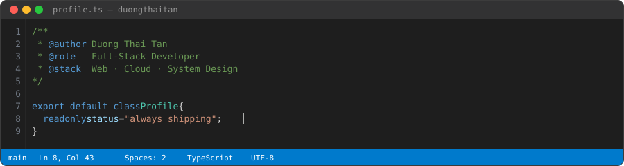
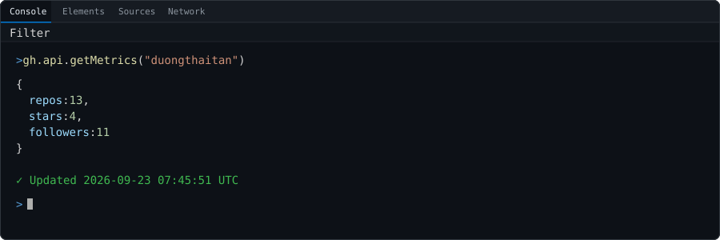

<p align="center">
  
</p>

<h1 align="center">Duong Thai Tan</h1>
<p align="center">
  <strong>Thoughtful interfaces. Expressive details. Code that holds up.</strong><br />
  Frontend developer &amp; UI/UX enthusiast based in Vietnam.
</p>

<p align="center">
  <a href="#selected-work">Selected work</a> &nbsp; / &nbsp;
  <a href="#github-snapshot">GitHub snapshot</a> &nbsp; / &nbsp;
  <a href="https://www.linkedin.com/in/duongthaitan/">LinkedIn</a> &nbsp; / &nbsp;
  <a href="https://www.instagram.com/thaitan.duong_">Photography</a>
</p>


## A little about me

I build responsive web interfaces with an eye for layout, motion, and the small details that make a product feel considered. Clean, maintainable code matters as much as the pixels.

Away from the editor, I explore **photography and video editing**. Different tools, same curiosity: how do you turn an idea into something people feel?

**Currently exploring**
- **Vue.js** — reusable components and frontend architecture.
- **Three.js** — interactive geometry and immersive web experiences.
- **Design systems** — consistent interfaces, accessible patterns, less guesswork.

## The toolkit

| Area | Tools & technologies |
| :--- | :--- |
| Interfaces | HTML · CSS · JavaScript · Vue.js · Bootstrap |
| Creative web | Three.js · Figma · Photoshop |
| Workflow | GitHub · VS Code · MySQL · Selenium |

<details>
<summary>More languages & frameworks I've worked with</summary>

PHP · Laravel · Java · C# · .NET · C++

</details>


## Selected work

### 01 / An orbital playground

**A 3D portfolio built with Three.js.** Wireframe geometry, orbiting particles, bloom, and pointer interaction — an experiment where frontend meets motion design.

**HTML · CSS · JavaScript · Three.js**

[Explore the source](./3d-portfolio/index.html) · [Open the GitHub Pages version](https://duongthaitan.github.io/duongthaitan/3d-portfolio/index.html)

<sub>The interactive scene runs on its own page. GitHub READMEs display images, not JavaScript or WebGL.</sub>

## GitHub snapshot

<p align="center">
  
</p>

**Public data. Clear scope. No invented streaks.**

- **Original repositories:** public repositories owned by this account, excluding forks; archived repositories included.
- **Stars:** total stars on those same repositories, not stars I've given other projects.
- **Followers:** the account's public follower count.

[Open the accessible snapshot](./assets/github-metrics.svg?raw=1) · [Browse repositories](https://github.com/duongthaitan?tab=repositories) · [View followers](https://github.com/duongthaitan?tab=followers) · [Inspect the renderer](./scripts/render-metrics.mjs)

<sub>Generated locally in GitHub Actions each day at 02:17 UTC / 09:17 Vietnam time. The image shows the last successful snapshot, not real-time activity. If GitHub is unavailable, the previous snapshot stays intact.</sub>


<details>
<summary><strong>Learning & certificates</strong></summary>

### F8 Fullstack
- [IT Onboarding](https://fullstack.edu.vn/cert/4tv2o)
- [JavaScript Basic](https://fullstack.edu.vn/cert/d0gj4)
- [PHP Introduction](https://fullstack.edu.vn/cert/kj7vr)

### SoloLearn
- [PHP Course](https://www.sololearn.com/certificates/CT-11PGKZIX)
- [Introduction to C](https://www.sololearn.com/certificates/CC-USOBZSX7)

</details>

<details>
<summary><strong>Under the hood / running this profile</strong></summary>

The artwork lives in this repository. Native SVG animation supplies the motion; a dependency-free Node.js script supplies the numbers. No external stats-image service, tracking counter, or borrowed contribution graph.

### Local checks

Requires **Node.js 24 or newer**. No install step.

```sh
node --test scripts/render-metrics.test.mjs
node scripts/render-metrics.mjs
```

The second command fetches public GitHub data and updates the local SVG. No credentials are required for a local run; GitHub's unauthenticated rate limits apply.

### Enable automatic updates

1. Put these files in the public **`duongthaitan/duongthaitan`** repository on **`main`**. A profile README must live at the root of a repository matching the account name.
2. Open **Actions → Update public profile metrics → Run workflow**. The workflow requests write access only to repository contents and uses GitHub's built-in token; no personal access token is needed.
3. The workflow tests the renderer, generates the snapshot, then updates only **`assets/github-metrics.svg`**. Repository rules must permit that automated update. Nothing is force-pushed.

The schedule runs on the default branch. GitHub may delay scheduled jobs or disable them after 60 days without repository activity; re-enable the workflow in Actions if necessary. Changes to the renderer or workflow also trigger an update on `main`.

The 3D page requires a separate GitHub Pages deployment. Its source remains usable locally even when Pages is not enabled. Hero animations stop after their introduction and respect reduced-motion preferences; all essential information remains available as text.

</details>

<br />

<p align="center">
  <strong>Let's make the web a little more interesting.</strong><br />
  <a href="https://github.com/duongthaitan">GitHub</a> &nbsp; / &nbsp;
  <a href="https://www.linkedin.com/in/duongthaitan/">LinkedIn</a> &nbsp; / &nbsp;
  <a href="https://www.instagram.com/thaitan.duong_">Instagram</a>
</p>
<p align="center"><sub>Designed with intent. Built one detail at a time.</sub></p>
