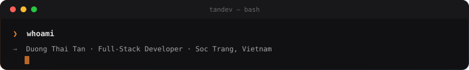
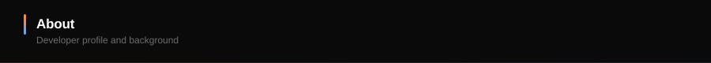
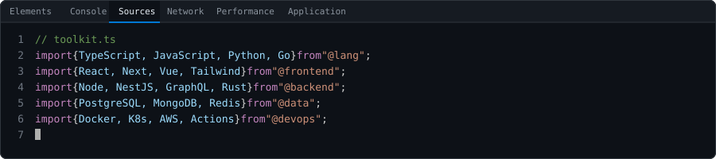
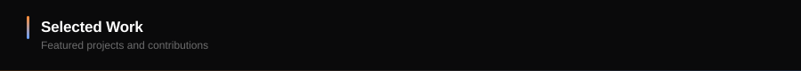
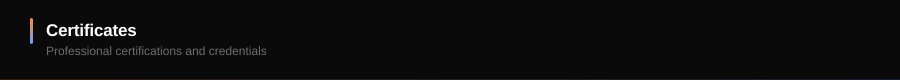
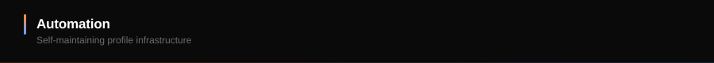
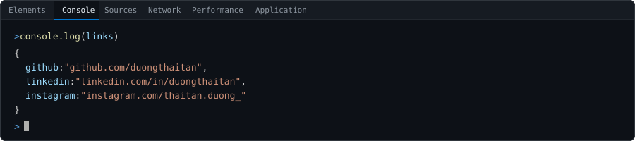

  

  

  

 

  <a href="#about">About</a> · <a href="#toolkit">Toolkit</a> · <a href="#selected-work">Selected Work</a> · <a href="#certificates">Certificates</a> · <a href="#automation">Automation</a> · <a href="#connect">Connect</a>

 

<!-- ─── ABOUT ─── -->

## About

Full-stack developer focused on building production-grade web applications and cloud infrastructure. I approach software as a craft — clean architecture, thorough testing, and thoughtful design over quick fixes.

Currently shipping TypeScript across the stack, from React frontends to Node.js services backed by PostgreSQL and deployed on AWS. I build systems designed to scale and maintain.

<!-- ─── TOOLKIT ─── -->

## Toolkit

**Languages** &nbsp;     

**Frontend** &nbsp;     

**Backend** &nbsp;   

**Data** &nbsp;   

**DevOps** &nbsp;    

<!-- ─── SELECTED WORK ─── -->

## Selected Work

| Project | Description | Stack |
|---------|-------------|-------|
| **3D Interactive Portfolio** | WebGL-powered interactive portfolio with real-time 3D rendering | Three.js · React · GLSL |
| **Enterprise Platform** | Full-stack SaaS platform with multi-tenant architecture | Next.js · NestJS · PostgreSQL |
| **AI Research Suite** | ML pipeline orchestration with model training dashboards | Python · FastAPI · PyTorch |
| **Open Source Tools** | Developer utilities and CLI tools for workflow automation | Node.js · Go · GitHub Actions |

<!-- ─── CERTIFICATES ─── -->

## Certificates

| Certificate | Issuer | Credential |
|-------------|--------|------------|
| Meta Front-End Developer Professional | Meta | [cert/4tv2o](https://www.coursera.org/account/accomplishments/professional-cert/4tv2o) |
| Google Cloud Digital Leader | Google | [cert/d0gj4](https://www.coursera.org/account/accomplishments/professional-cert/d0gj4) |
| IBM Full Stack Software Developer | IBM | [cert/kj7vr](https://www.coursera.org/account/accomplishments/professional-cert/kj7vr) |
| AWS Cloud Solutions Architect | Amazon | [CT-11PGKZIX](https://www.credly.com/badges/CT-11PGKZIX) |
| Deep Learning Specialization | DeepLearning.AI | [CC-USOBZSX7](https://www.coursera.org/account/accomplishments/specialization/CC-USOBZSX7) |

<!-- ─── AUTOMATION ─── -->

## Automation

This profile is self-maintaining. GitHub Actions runs daily to:

1. **Fetch live metrics** from the GitHub API (repos, stars, followers)
2. **Render an SVG** panel with the latest data via `scripts/render-metrics.mjs`
3. **Run security checks** — the test suite validates no scripts, external references, or unsafe content in any SVG
4. **Push atomically** — the metrics asset updates only if the content changed and the remote SHA matches

All SVGs are generated from JS scripts — no external image services, no third-party actions.

<!-- ─── CONNECT ─── -->

## Connect

  &nbsp;
  &nbsp;
  

 

  

